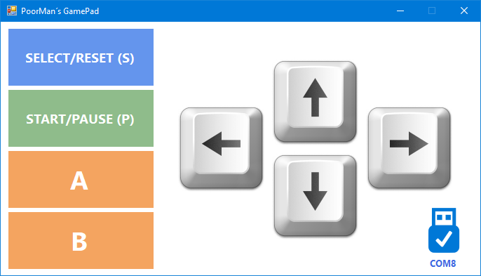

# PoorMan´s GamePad
 **A simple GamePad for my Teensy 4.x games in C#**.

 Copyright (C) 2021 by DIYLAB <https://www.diylab.de>

This simple interface detects a connected Teensy 4.x and communicates with it via the USB-Serial interface.
The concept is strongly expandable and serves only as an example to control my games :wink: .

### The following of my games are supported

- PacMan for Teensy 4.x (Project follows)
- Tetris for Teensy 4.x (Project follows)

### GitHub/Nuget packages used

1. TeensySharp <https://github.com/luni64/TeensySharp>
2. Hid Library <https://github.com/mikeobrien/HidLibrary> 

### Development software used

* Visual Studio 2019 community edition